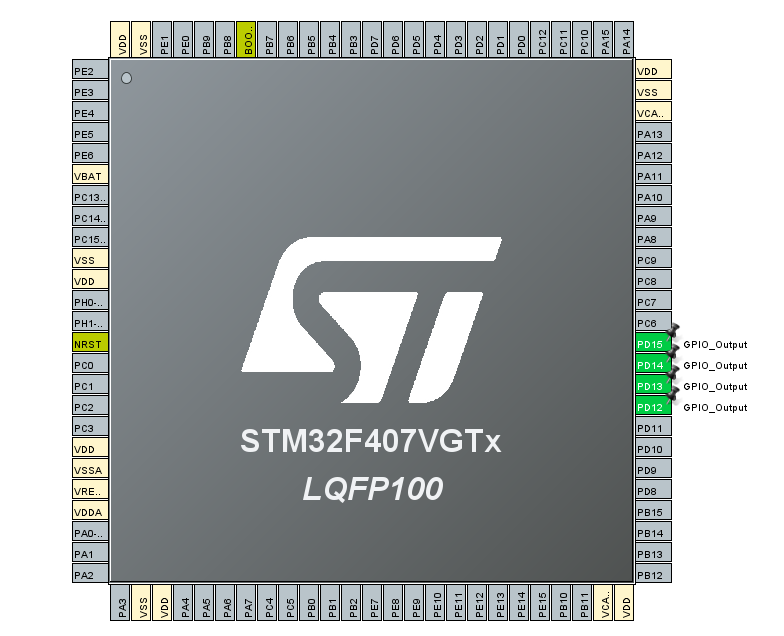

# Bare Metal Training 01: Hello World

The scheme of flashing LEDs in a round cycle on the *STM32F4DISCOVERY* board has been implemented. 4 LEDs are used, which are already built into the board.

## CubeMX

CubeMx has default settings selected. Four pins were selected: **PD12, PD13, PD14, PD15**. They have been switched to *GPIO_Output* mode.



## Code review

After generating the code based on CubeMX, changes were made to the `while(1){}` part where the main body of the program is executed.

```C
  while (1)
  {
    /* USER CODE END WHILE */

    /* USER CODE BEGIN 3 */
	  HAL_GPIO_WritePin(GPIOD, GPIO_PIN_12, GPIO_PIN_SET);
	  HAL_Delay(200);
	  HAL_GPIO_WritePin(GPIOD, GPIO_PIN_12, GPIO_PIN_RESET);	  

	  HAL_GPIO_WritePin(GPIOD, GPIO_PIN_13, GPIO_PIN_SET);
	  HAL_Delay(200);
	  HAL_GPIO_WritePin(GPIOD, GPIO_PIN_13, GPIO_PIN_RESET);	  

	  HAL_GPIO_WritePin(GPIOD, GPIO_PIN_14, GPIO_PIN_SET);
	  HAL_Delay(200);
	  HAL_GPIO_WritePin(GPIOD, GPIO_PIN_14, GPIO_PIN_RESET);	  

	  HAL_GPIO_WritePin(GPIOD, GPIO_PIN_15, GPIO_PIN_SET);
	  HAL_Delay(200);
	  HAL_GPIO_WritePin(GPIOD, GPIO_PIN_15, GPIO_PIN_RESET);
  }
  /* USER CODE END 3 */
```

This code allows the LEDs to blink. **Green**, **orange**, **red** and finally **blue**. And in round cycle.