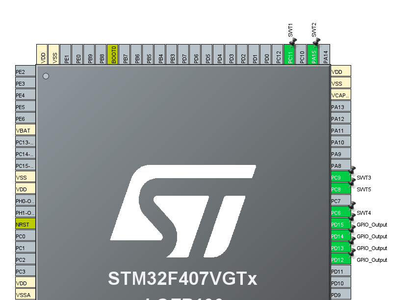
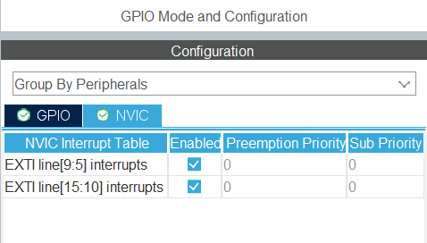

# Bare Metal Training 02: LEDs, Buttons, Interrupts.

Four LED blinking schemes are implemented on the *STM32F4DISCOVERY* board. They are controlled by 5 external buttons. 4 LEDs are used, which are already built into the board. 
The middle button can be used to turn blinking on or off, the other two to switch between blinking patterns, and the other two to change the frequency of blinking, increasing or decreasing the delay.

## CubeMX

CubeMx has default settings selected. Four pins were selected for LEDs: **PD12, PD13, PD14, PD15**. They have been switched to *GPIO_Output* mode. For the buttons, 5 pins are selected, which have been assigned *user labels* for convenience. Namely SWT1 - **PC11**, SWT2 - **PA15**, SWT3 - **PC9**, SWT4 - **PC6**, SWT5 - **PC8**.  Everyone has the *GPIO_EXTI* operating mode selected.



Button interrupts are also enabled on the NVIC tab:



## Code review

After the CubeMX-based code was generated, changes were made to the `while(1){}` part where the main part of the program is executed. In the eternal cycle, one of the selected schemes is launched. There are 4 of them. Each of them is placed in a separate function. Also, thanks to `flag` parameter, you can turn off flashing altogether.

```C
  while (1)
  {
    /* USER CODE BEGIN 3 */
	  if (flag == 1)
	  {
		 switch (schemeVar)
		 {
			case 1:
				BlinkingSchemes_1();
				break;
			case 2:
				BlinkingSchemes_2();
				break;
			case 3:
				BlinkingSchemes_3();
				break;
			case 4:
				BlinkingSchemes_4();
				break;
			default:
				break;
		}
	  }
	  else
	  {
		  HAL_GPIO_WritePin(GPIOD, GPIO_PIN_12|GPIO_PIN_13|GPIO_PIN_14|GPIO_PIN_15, GPIO_PIN_RESET);
	  }
  }
  /* USER CODE END 3 */
```

This code allows the LEDs to blink. **Green**, **orange**, **red** and finally **blue**. And in round cycle. You can also change the frequency, patterns or turn off blinking thanks to the buttons. This is implemented thanks to the code that runs when an interrupt occurs from pressing the button.

```C
void HAL_GPIO_EXTI_Callback(uint16_t GPIO_Pin)
{
	if (GPIO_Pin == SWT1_Pin)
	{
		if (delay != 0)
		{
			delay -= 50;
		};
	}
	if (GPIO_Pin == SWT2_Pin)
	{
		if (flag == 0)
		{
			flag = 1;
		}
		else
		{
			flag = 0;
		}
	}
	if (GPIO_Pin == SWT3_Pin)
	{
		if (delay != 3000)
		{
			delay += 50;
		};
	}
	if (GPIO_Pin == SWT4_Pin)
	{
		if(schemeVar < 4)
		{
			schemeVar++;
		}
	}
	if (GPIO_Pin == SWT5_Pin)
	{
		if(schemeVar > 1)
		{
			schemeVar--;
		}
	}
}
```


