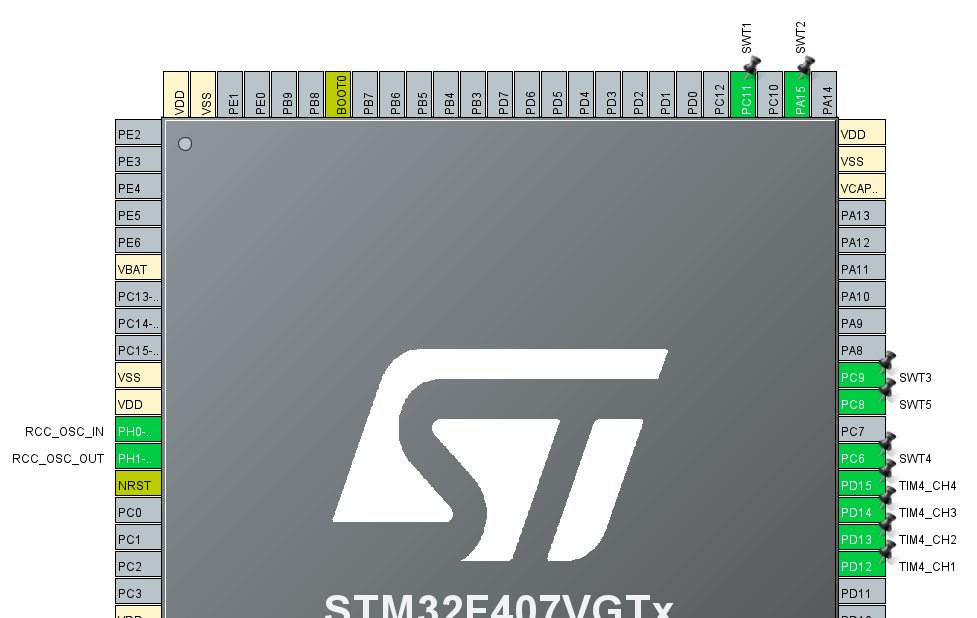
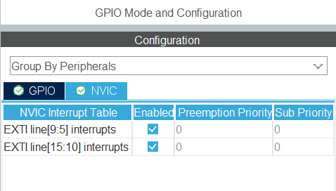
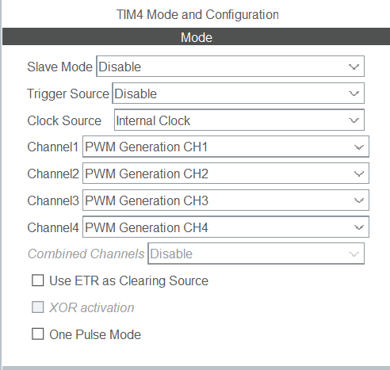
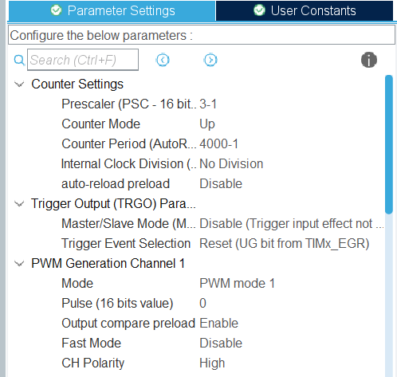
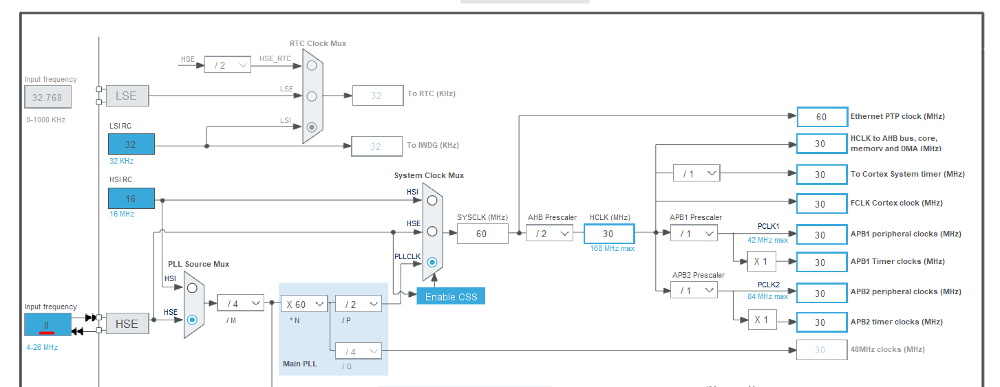
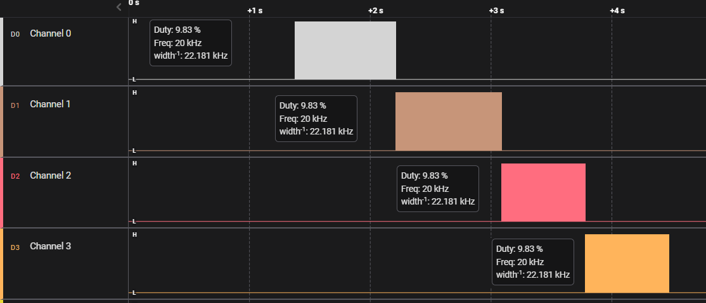
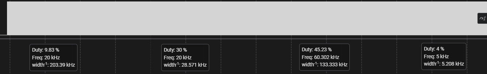

# Bare Metal Training 03: Timers and PWM

A PWM signal generator is implemented. An external clock (HSE) located on the *STM32F4DISCOVERY* board is connected. 4 built-in LEDs are also used to output the created PWM. 5 external buttons are used to select the LED, as well as frequency and duty cycle.

## CubeMX

CubeMx has default settings selected. Four pins were selected for LEDs: **PD12, PD13, PD14, PD15**. They have been switched to *TIM4_CHN* mode, where *N* channel number between 1 and 4. For the buttons, 5 pins are selected, which have been assigned *user labels* for convenience. Namely SWT1 - **PC11**, SWT2 - **PA15**, SWT3 - **PC9**, SWT4 - **PC6**, SWT5 - **PC8**.  Everyone has the *GPIO_EXTI* operating mode selected. Also, 2 outputs are automatically created for the external clock, which will be discussed later.



Button interrupts are also enabled on the NVIC tab:



The following settings are selected for TIM4 and its channels:


&nbsp;


Changes have also been made to the *Clock Configuration* tab. An external clock (HSE) has been selected and the appropriate dividers have been set.



## Code review

After generating the code based on CubeMX, changes were made to the `while(1){}` part where the main body of the program is executed.

```C
  while (1)
  {
    /* USER CODE BEGIN 3 */

	 switch (schemeVar)
	 {
		case 0:
			timer_pwm_stop(&TIM4->CCR1);
			timer_pwm_stop(&TIM4->CCR2);
			timer_pwm_stop(&TIM4->CCR3);
			timer_pwm_stop(&TIM4->CCR4);
			break;
		case 1:
			timer_pwm_stop(&TIM4->CCR4);
			timer_pwm_run(&active_timer, &TIM4->CCR1);
			break;
		case 2:
			timer_pwm_stop(&TIM4->CCR1);
			timer_pwm_run(&active_timer, &TIM4->CCR2);
			break;
		case 3:
			timer_pwm_stop(&TIM4->CCR2);
			timer_pwm_run(&active_timer, &TIM4->CCR3);
			break;
		case 4:
			timer_pwm_stop(&TIM4->CCR3);
			timer_pwm_run(&active_timer, &TIM4->CCR4);
			break;
		default:
			break;
	}

  }
  /* USER CODE END 3 */
```

This code blinks the currently selected LED, or turns off all LEDs altogether. **Green**, **Orange**, **Red** and finally **Blue**. For this, a corresponding library written by me is used. It allows you to choose an active LED, change its frequency and duty cycle. This can be done thanks to the buttons. This is accomplished by code that runs when an interrupt occurs from a button press. 

```C
void HAL_GPIO_EXTI_Callback(uint16_t GPIO_Pin)
{
	if (GPIO_Pin == SWT1_Pin)
	{
		timer_pwm_add_step(&active_timer, &TIM4->ARR);
	}
	if (GPIO_Pin == SWT2_Pin)
	{
		schemeVar++;
		schemeVar = schemeVar%5;
	}
	if (GPIO_Pin == SWT3_Pin)
	{
		timer_pwm_remove_step(&active_timer, &TIM4->ARR);
	}
	if (GPIO_Pin == SWT4_Pin)
	{
		timer_pwm_add_duty(&active_timer);
	}
	if (GPIO_Pin == SWT5_Pin)
	{
		timer_pwm_remove_duty(&active_timer);
	}
}
```

## Library *timer_pwm*

The created library allows the user to change the desired frequency and duty cycle of blinking LEDs without bothering with changes in ARR and CCR parameters. The library will automatically transform, round and bring everything to the most desired appearance.

### **Struct**

An appropriate structure was created to record information about the selected frequency and duty cycle. Also, new names via `typedef` have been assigned for convenience.

```C
typedef uint32_t value_CCR_t;
typedef uint32_t value_ARR_t;
typedef uint16_t value_Hertz_t;

typedef struct timer_pwm_s
{
    value_Hertz_t actual;
    value_CCR_t valid_CCR;
    value_ARR_t valid_ARR;
} timer_pwm_t;
```

### **Function**

These functions were created for the task, namely:
 * [`timer_pwm_init`](#timer_pwm_init), 
 * [`timer_pwm_add_step`](#timer_pwm_add_step), 
 * [`timer_pwm_remove_step`](#timer_pwm_remove_step), 
 * [`timer_pwm_add_duty`](#timer_pwm_add_duty), 
 * [`timer_pwm_remove_duty`](#timer_pwm_remove_duty), 
 * [`timer_pwm_change_ARR`](#timer_pwm_change_arr), 
 * [`timer_pwm_change_CCR`](#timer_pwm_change_ccr), 
 * [`timer_pwm_run`](#timer_pwm_run), 
 * [`timer_pwm_stop`](#timer_pwm_stop).


#### ***timer_pwm_init***

Initializes the *struct* with the prescaler value and the current frequency value in Hertz. Also sets the default value for duty cycle.

```C
void timer_pwm_init(timer_pwm_t* self, value_Hertz_t actual, value_Hertz_t value_after_PSC)
{
    self->actual = actual;
    self->valid_CCR = 0;
    valid_after_PSC = value_after_PSC;    
    self->valid_ARR = value_after_PSC / actual - 1;
    duty = 10;
    timer_pwm_change_CCR(self);
}
```

#### ***timer_pwm_add_step***

Increases the current value in Hertz by one *step* and also prevents it from going out of the specified range. After runs a function to change the ARR value.

```C
static value_Hertz_t MAX_HERTZ = 100;
static value_Hertz_t STEP_HERTZ = 5;

void timer_pwm_add_step(timer_pwm_t* self, value_ARR_t* valid_ARR)
{
    if (self->actual + STEP_HERTZ <= MAX_HERTZ)
    {
        self->actual += STEP_HERTZ;
    }  
    
    timer_pwm_change_ARR(self, valid_ARR);
}
```

#### ***timer_pwm_remove_step***

Decreases the current hertz value by one *step* and prevents it from going out of the specified range. After runs a function to change the ARR value.

```C
static value_Hertz_t MIN_HERTZ = 5;
static value_Hertz_t STEP_HERTZ = 5;

void timer_pwm_remove_step(timer_pwm_t* self, value_ARR_t* valid_ARR)
{
    if (self->actual - STEP_HERTZ >= MIN_HERTZ)
    {
        self->actual -= STEP_HERTZ;
    }  
    
    timer_pwm_change_ARR(self, valid_ARR);
}
```

#### ***timer_pwm_add_duty***

Increases the current duty cycle value by one *step* and prevents it from going beyond the specified range. After runs the function to change the CCR value.

```C
void timer_pwm_add_duty(timer_pwm_t* self)
{
    if (duty + 5 <= 100)
    {
        duty += 5;
    }

    timer_pwm_change_CCR(self);
}
```

#### ***timer_pwm_remove_duty***

Decreases the current duty cycle value by one *step* and prevents it from exceeding the specified range. After runs the function to change the CCR value.

```C
void timer_pwm_remove_duty(timer_pwm_t* self)
{
    if (duty - 5 >= 0)
    {
        duty -= 5;
    }

    timer_pwm_change_CCR(self);
}
```

#### ***timer_pwm_change_ARR***

Updates the externally received ARR value based on the current frequency in Hertz.

```C
void timer_pwm_change_ARR(timer_pwm_t* self, volatile value_ARR_t* valid_ARR)
{
    self->valid_ARR = valid_after_PSC / self->actual;
    *valid_ARR = self->valid_ARR - 1;
}
```

#### ***timer_pwm_change_CCR***

Updates CCR value for the struct. Does not need the value of CCR externally, as it sets the total duty cycle. And it will change for a particular PWM when it starts up.

```C
void timer_pwm_change_CCR(timer_pwm_t* self)
{
    self->valid_CCR = self->valid_ARR * duty / 100;    
}
```

#### ***timer_pwm_run***

Changes the actual CRR received from the outside. Usually the received CCR is zero, so it can be said that it is *"launched"*.

```C
void timer_pwm_run(timer_pwm_t* self, volatile value_CCR_t* this_CCR)
{
    *this_CCR = self->valid_CCR;
}
```

#### ***timer_pwm_stop***

Resets CRR received from outside. As the CCR becomes zero, it can be said to be *"stopped"*.

```C
void timer_pwm_stop(volatile value_CCR_t* this_CCR)
{
    *this_CCR = 0;
}
```

## Result

The Logic program was used to visualize the data. In it, you can see what each PWM channel looks like after startup.



Also an example of changing frequency and duty cycle.



These images are overview, and to better see the essence of the changes, you can use the [.sal](../../photoForReadme/Bare_Metal_Training/task03/Session_task03.sal) file from which the screenshots were made.
