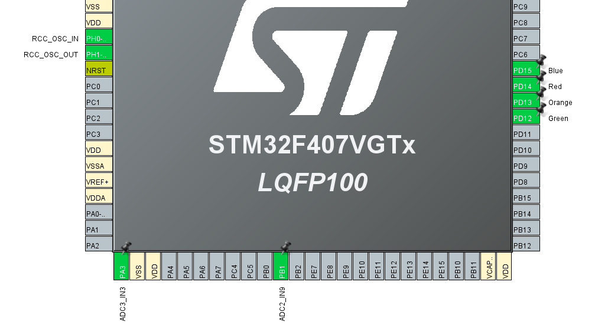
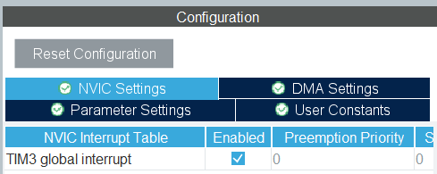
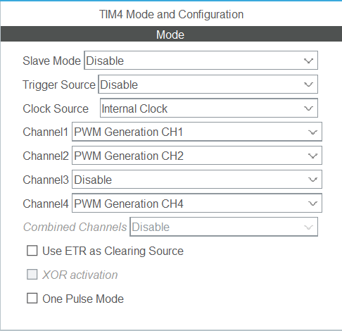
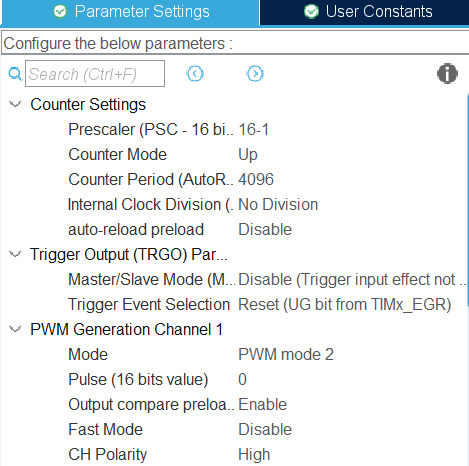
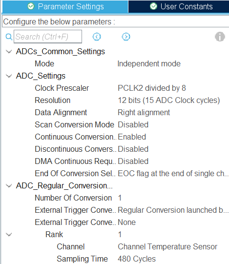
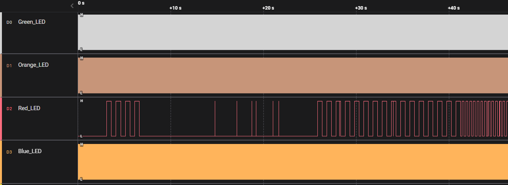

# Bare Metal Training 04: ADC_TempSensor

Voltage reading from potentiometer, internal and external temperature sensor is implemented. PWM is used for the output, which is transmitted to 4 built-in LEDs on the *STM32F4DISCOVERY* board.

You can show the voltage of the potentiometer using the **Blue** LED (change in light intensity). The temperature is also read from the internal temperature sensor (inside the STM32F407). It is possible to show the temperature using the **Orange** LED (change in light intensity). The temperature is also read from an external analog temperature sensor. Temperature display is available using the **Green** LED (light intensity change).   
The **Red** LED is off if there are no "emergency situations" when the values received from the sensors exceed a certain threshold. It blinkes at 1 Hz if we have "one emergency", it flashes at 2.5 Hz in case we have 2 "emergencies" at the same time. And with 5 Hz - if all 3 "emergency situations" are present.

## CubeMX

CubeMx has default settings selected. Four contacts were chosen for LEDs: **PD12, PD13, PD14, PD15**. Also created *user labels* corresponding to pins as **Green**, **Orange**, **Red**, **Blue** respectively. All pins except Red are set to *TIM4_CHN* mode, where *N* is channel number 1, 2, 4. *GPIO_Output* mode is selected for Red.  
Also uses 3 available ADCs. The first is for the internal temperature sensor. The second is for the external temperature sensor on port *PB1*. The third for the potentiometer on port *PA3*.  
Also, 2 outputs for the external clock are automatically created, which will be discussed later.



TIM3 for interrupting the Red LED is also enabled on the NVIC tab:



The following settings are selected for TIM4 and its channels:


&nbsp;


Since the ADC is set to 12-bit mode, the ARR is set to 4096 so that it is possible to immediately change the duty cycle value, depending on the result that will be received from the sensors.

Actually, the ADCs is configured as follows:




## Code review

After generating the code based on CubeMX, changes were made to the `while(1){}` part where the main body of the program is executed.

```C
  while (1)
  {
    /* USER CODE BEGIN 3 */

	//inner_temp
	getADCValue(&hadc1, &innerTemp_Value1);
	TIM4->CCR2 = innerTemp_Value1;//4096 - innerTemp_Value1;

	//exter_temp
	getADCValue(&hadc2, &extTemp_Value2);
	TIM4->CCR1 = extTemp_Value2;

	//potentiometer
	getADCValue(&hadc3, &potent_Value3);
	TIM4->CCR4 = potent_Value3;

	//hysteresis
	innerTemp_Value1_output = useHysteresis(innerTemp_Value1, innerTemp_Value1_output, 10);
	extTemp_Value2_output = useHysteresis(extTemp_Value2, extTemp_Value2_output, 10);
	potent_Value3_output = useHysteresis(potent_Value3, potent_Value3_output, 50);

	changeRedLedBlinking(innerTemp_Value1_output, extTemp_Value2_output, potent_Value3_output);

  }
  /* USER CODE END 3 */
```

This code takes measurements on 3 sensors and then performs hysteresis to smooth the input data.

Additionally, a clock simulated by a PWM signal was initialized for the **Green**, **Orange**, and **Blue** LEDs. And a clock to blink the **Red** LED. This code is executed in the `main` function.

```C
  HAL_TIM_PWM_Start(&htim4, TIM_CHANNEL_1);
  HAL_TIM_PWM_Start(&htim4, TIM_CHANNEL_2);
  HAL_TIM_PWM_Start(&htim4, TIM_CHANNEL_4);

  HAL_TIM_Base_Start_IT(&htim3);

  TIM4->ARR = 4096;
  TIM4->CCR1 = 0;
  TIM4->CCR2 = 0;
  TIM4->CCR4 = 0;
```

### **Function**

These functions were created for the task, namely:
 * [`getADCValue`](#getadcvalue), 
 * [`useHysteresis`](#usehysteresis), 
 * [`changeRedLedBlinking`](#changeredledblinking).


#### ***getADCValue***

Takes a reading from a specific ADC tied to a specific sensor.

```C
void getADCValue(ADC_HandleTypeDef* hadc, uint32_t* adc_Value)
{
	volatile HAL_StatusTypeDef adcPoolResult;

	HAL_ADC_Start(hadc);
	adcPoolResult = HAL_ADC_PollForConversion(hadc, 1);

	if (adcPoolResult == HAL_OK)
	{
		*adc_Value = HAL_ADC_GetValue(hadc);
	}
	HAL_ADC_Stop(hadc);
}
```

#### ***useHysteresis***

Eliminates possible unwanted fluctuations when reading data from sensors.

```C
uint32_t useHysteresis(uint32_t input_signal, uint32_t output_signal, uint32_t hysteresis)
{
    if (input_signal > output_signal + hysteresis)
    {
        output_signal = input_signal - hysteresis;
    }
    else if (input_signal < output_signal - hysteresis)
    {
        output_signal = input_signal + hysteresis;
    }
    return output_signal;
}
```

#### ***changeRedLedBlinking***

Changes the blinking frequency of the **Red** LED depending on the number of critical states.

```C
const uint32_t CRITICAL_POTENTIOMETER_VALUE = 2800;
const uint32_t CRITICAL_INNER_TEMP_VALUE = 1120;
const uint32_t CRITICAL_EXTERN_TEMP_VALUE = 1000;

void changeRedLedBlinking(uint32_t innerTemp_Value, uint32_t extTemp_Value, uint32_t potent_Value)
{
	flag = 0;

	if (innerTemp_Value > CRITICAL_INNER_TEMP_VALUE)
	{
		++flag;
	}
	if (extTemp_Value < CRITICAL_EXTERN_TEMP_VALUE)
	{
		++flag;
	}
	if (potent_Value > CRITICAL_POTENTIOMETER_VALUE)
	{
		++flag;
	}

	switch (flag)
	{
		case 0:
			HAL_TIM_Base_Stop_IT(&htim3);
			HAL_GPIO_WritePin(Red_GPIO_Port, Red_Pin, GPIO_PIN_RESET);
			break;
		case 1:
			TIM3->ARR = 500-1; // 1 Hz
			break;
		case 2:
			TIM3->ARR = 200-1; // 2.5 Hz
			break;
		case 3:
			TIM3->ARR = 100-1; // 5 Hz
			break;
		default:
			//error_number++;
			break;
	}

	if (flag != 0)
	{
		HAL_TIM_Base_Start_IT(&htim3);
	}
}
```

## Result

The Logic program was used to visualize the data. In it, you can see what each PWM channel looks like after startup. And also how the Red Led turns on and changes its frequency during the performance.



This image is an overview, and to better understand the essence of the changes, you can use the file [.sal](../../photoForReadme/Bare_Metal_Training/task04/Session_task04.sal) file from which the screenshots were made. Because only in it you can see how the duty cycle changes during the heating of temperature sensors or turning the knob of the potentiometer.
