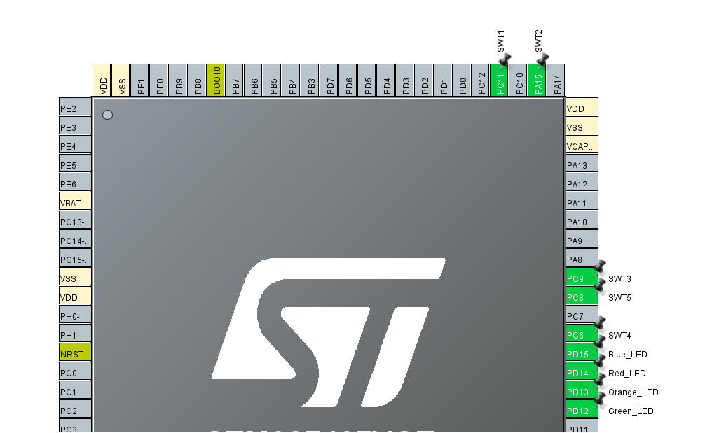
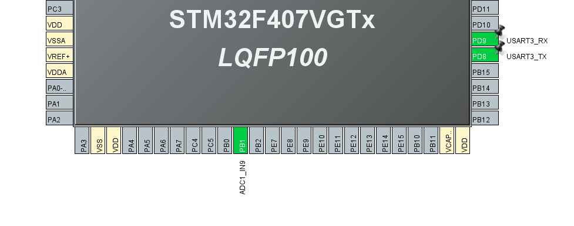
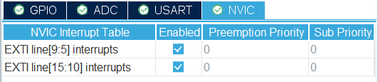
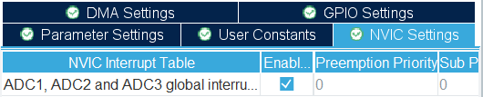
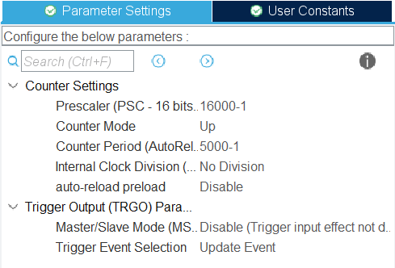
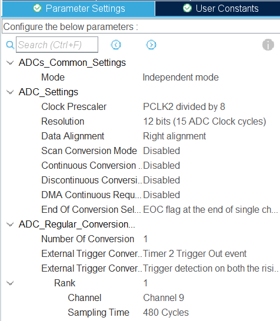
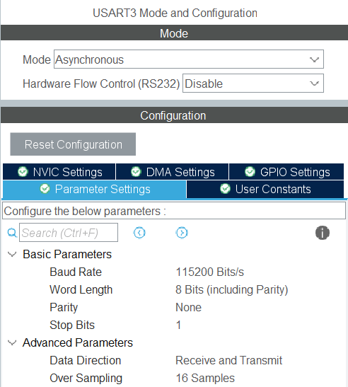
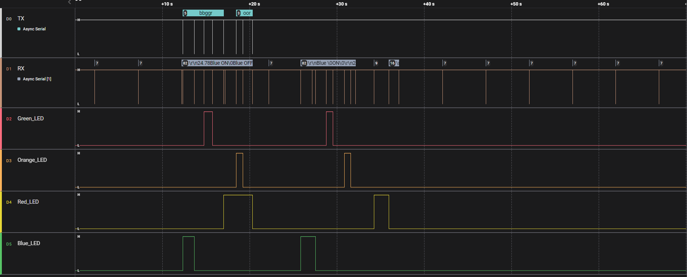

# Bare Metal Training 05: UART

Implemented reading and rewriting for 16 Mbit SPI Serial Flash memory. It is also possible to output the read information to the console through the UART interface. It is possible to enter commands through the console to clear, read, write, change registers. 2 LEDs are also used to inform the user: red and blue.

## CubeMX

CubeMx has default settings selected. Four contacts were chosen for LEDs: **PD12, PD13, PD14, PD15**. Also created *user labels* corresponding to pins as **Green_LED**, **Orange_LED**, **Red_LED**, **Blue_LED** respectively. They have been switched to *GPIO_Output* mode.  
For the buttons, 5 pins are selected, which have been assigned *user labels* for convenience. Namely SWT1 - **PC11**, SWT2 - **PA15**, SWT3 - **PC9**, SWT4 - **PC6**, SWT5 - **PC8**.  Everyone has the *GPIO_EXTI* operating mode selected. 



Also uses ADC1 to take the temperature from an external thermistor. It is on port *PB1*.  
The USART3 module was used to implement the UART interface. It has pin **PD9** as USART3_RX and pin **PD8** as USART3_TX. 



Button and ADC interrupts are enabled on the NVIC tab:


&nbsp;



TIM2 is designed to activate the temperature reading in ADC1 every 5 seconds. The following parameters are selected for it:



Since the ADC is configured for 12-bit mode, the ARR is set to 4096 to make the most accurate measurements possible.
Actually, the ADC is configured as follows:



The following settings were set for UART:



## Code review

After generating the code based on CubeMX, changes were made to the `while(1){}` part where the main body of the program is executed.

```C
typedef enum
{
	  LED_Blue,
	  LED_Red,
	  LED_Orange,
	  LED_Green
} led_color_t;

led_status_t led_state[4] = {};

  while (1)
  {
	uint8_t rcvBuf[1];
	HAL_StatusTypeDef result;
	char* statusText;

	result = HAL_UART_Receive(&huart3, rcvBuf, 1, 10);

	if (result == HAL_OK)
	{
		switch (rcvBuf[0])
		{
			case 'b':
				HAL_GPIO_TogglePin(Blue_LED_GPIO_Port, Blue_LED_Pin);
				led_state[LED_Blue] = (led_state[LED_Blue] + 1) % 2;
				HAL_UART_Transmit(&huart3, (uint8_t *)"Blue ", 5, 10);

				statusText = getStatusText(led_state[LED_Blue]);
				HAL_UART_Transmit(&huart3, (uint8_t *)  statusText, 3, 10);
				break;

			case 'r':
				HAL_GPIO_TogglePin(Red_LED_GPIO_Port, Red_LED_Pin);
				led_state[LED_Red] = (led_state[LED_Red] + 1) % 2;
				HAL_UART_Transmit(&huart3, (uint8_t *)  "Red ", 4, 10);

				statusText = getStatusText(led_state[LED_Red]);
				HAL_UART_Transmit(&huart3, (uint8_t *)  statusText, 3, 10);
				break;

			case 'o':
				HAL_GPIO_TogglePin(Orange_LED_GPIO_Port, Orange_LED_Pin);
				led_state[LED_Orange] = (led_state[LED_Orange] + 1) % 2;
				HAL_UART_Transmit(&huart3, (uint8_t *)"Orange ", 7, 10);

				statusText = getStatusText(led_state[LED_Orange]);
				HAL_UART_Transmit(&huart3, (uint8_t *)  statusText, 3, 10);
				break;

			case 'g':
				HAL_GPIO_TogglePin(Green_LED_GPIO_Port, Green_LED_Pin);
				led_state[LED_Green] = (led_state[LED_Green] + 1) % 2;
				HAL_UART_Transmit(&huart3, (uint8_t *)"Green ", 6, 10);

				statusText = getStatusText(led_state[LED_Green]);
				HAL_UART_Transmit(&huart3, (uint8_t *)  statusText, 3, 10);
				break;

			default:
				HAL_UART_Transmit(&huart3, (uint8_t *)"\r\nUnexpCmd", 10, 10);
				break;
		}
	}
  }
```

This code executes the read command typed into the console. According to the entered command, the corresponding LED turns on or off. And the status message of that LED is sent back.

### **Function**

These functions were created for the task, namely:
 * [`getStatusText`](#getadcvalue), 
 * [`convertVoltageToCelsius`](#usehysteresis).

Also created 2 interrupt callable functions:
 * [`HAL_GPIO_EXTI_Callback`](#changeredledblinking),
 * [`HAL_ADC_ConvCpltCallback`](#changeredledblinking).


#### ***getStatusText***

Returns the status of a certain LED as a text string

```C
typedef enum
{
	  LED_OFF,
	  LED_ON
} led_status_t;

char* getStatusText(led_status_t led_state)
{
	switch (led_state) {
		case LED_ON:
			return "ON";
			break;

		case LED_OFF:
			return "OFF";
			break;

		default:
			return "Error";
			break;
	}
}
```

#### ***convertVoltageToCelsius***

Converts input voltage value to temperature. A formula is used that takes into account the linear relationship between the resistance in the thermistor (that is, the voltage that will be received) and temperature.

```C
const float RESULUTION = 4096;
float voltage = 2.95;

// Celsius from 0 to 99.99
char* convertVoltageToCelsius(float adcVoltage_Value)
{
	float celsius;
	float stepVoltage = RESULUTION / voltage;

	celsius = (2.02 - adcVoltage_Value / stepVoltage) / 0.02;

	static char txbuf[7];
	txbuf[0] = '\r';
	txbuf[1] = '\n';
	txbuf[2] = (char) (celsius / 10) % 10 + '0';
	txbuf[3] = (char)celsius % 10 + '0';
	txbuf[4] = '.';
	txbuf[5] = (char)(celsius*10) % 10 + '0';
	txbuf[6] = (char)(celsius*100) % 10 + '0';

	return txbuf;
}
```

#### ***HAL_GPIO_EXTI_Callback***

This function is activated when one of the buttons is pressed. The corresponding LED is turned on or off, and its active status is reported to the console via UART. This code is only executed when an interrupt occurs after the button is pressed.

```C
void HAL_GPIO_EXTI_Callback(uint16_t GPIO_Pin)
{
	char* statusText;

	if (GPIO_Pin == SWT1_Pin)
	{
		HAL_GPIO_TogglePin(Blue_LED_GPIO_Port, Blue_LED_Pin);
		led_state[LED_Blue] = (led_state[LED_Blue] + 1) % 2;
		HAL_UART_Transmit(&huart3, (uint8_t *)"\r\nBlue ", 8, 10);

		statusText = getStatusText(led_state[LED_Blue]);
		HAL_UART_Transmit(&huart3, (uint8_t *)  statusText, 3, 10);
	}
	if (GPIO_Pin == SWT2_Pin)
	{
		//Debug_Button
	}
	if (GPIO_Pin == SWT3_Pin)
	{
		HAL_GPIO_TogglePin(Orange_LED_GPIO_Port, Orange_LED_Pin);
		led_state[LED_Orange] = (led_state[LED_Orange] + 1) % 2;
		HAL_UART_Transmit(&huart3, (uint8_t *)"\r\nOrange ", 9, 10);

		statusText = getStatusText(led_state[LED_Orange]);
		HAL_UART_Transmit(&huart3, (uint8_t *)  statusText, 3, 10);
	}
	if (GPIO_Pin == SWT4_Pin)
	{
		HAL_GPIO_TogglePin(Red_LED_GPIO_Port, Red_LED_Pin);
		led_state[LED_Red] = (led_state[LED_Red] + 1) % 2;
		HAL_UART_Transmit(&huart3, (uint8_t *)"\r\nRed ", 6, 10);

		statusText = getStatusText(led_state[LED_Red]);
		HAL_UART_Transmit(&huart3, (uint8_t *)  statusText, 3, 10);
	}
	if (GPIO_Pin == SWT5_Pin)
	{
		HAL_GPIO_TogglePin(Green_LED_GPIO_Port, Green_LED_Pin);
		led_state[LED_Green] = (led_state[LED_Green] + 1) % 2;
		HAL_UART_Transmit(&huart3, (uint8_t *)"\r\nGreen ", 8, 10);

		statusText = getStatusText(led_state[LED_Green]);
		HAL_UART_Transmit(&huart3, (uint8_t *)  statusText, 3, 10);
	}
}
```

#### ***HAL_ADC_ConvCpltCallback***

This function takes a temperature reading from the sensor and then sends it to the console. It is also called by a timer with a certain periodicity.

```C
void HAL_ADC_ConvCpltCallback(ADC_HandleTypeDef* hadc)
{
	float adc_Value = (float)HAL_ADC_GetValue(&hadc1);
	char* txbuf = convertVoltageToCelsius(adc_Value);

	HAL_UART_Transmit(&huart3, (uint8_t*)txbuf, 7, 10);
}
```

## Result

The Logic program was used to visualize the data. In it, you can see how the signals are sent through the RX and TX channels. How LEDs react to incoming commands. As well as messages coming to the console through the RX channel from pressing buttons or as a response to commands.



This image is an overview, and to better understand the essence of the changes, you can use the file [.sal](../../photoForReadme/Bare_Metal_Training/task05/Session_task05.sal) file from which the screenshots were made.  In it, you can better understand how the commands were received and what was the reaction to them, as well as see how the temperature changed as a result of heating the thermistor.