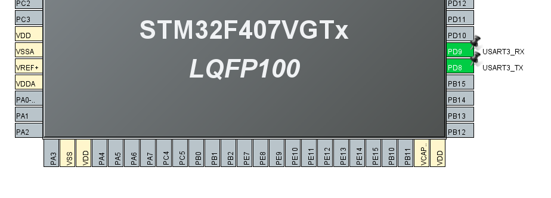

# Bare Metal Training 06: I2C

Created a library that works with a PWM LED controller (PCA9685). Implemented ability to enable/disable all outputs, set duty cycle, set PWM frequency, enable/disable sleep mode. I2C1 channel is used for communication with the controller (PCA9685). Commands are sent via the UART interface.

## CubeMX

CubeMx has default settings selected. The I2C1 module was used to implement the I2C interface. It has pin **PB9** as *I2C1_SDA* and pin **PB6** as *I2C1_SCL*. **PB7** is also used in *GPIO_Output* mode to enable PWM.


The USART3 module was used to implement the UART interface. It has pin **PD9** as *USART3_RX* and pin **PD8** as *USART3_TX*. 



Interrupts and DMA are enabled for the UART:


&nbsp;


I2C is configured according to control the PWM LED controller.


The following settings were set for UART:


## Code review

After generating the code based on CubeMX, changes were made to the `main` part, which is where the developer can contribute his code.

```C
  HAL_Delay(10);

  HAL_UARTEx_ReceiveToIdle_DMA(&huart3, RxBuf, RxBuf_SIZE);
  __HAL_DMA_DISABLE_IT(&hdma_usart3_rx, DMA_IT_HT);

  HAL_GPIO_WritePin(GPIOB, GPIO_PIN_7, GPIO_PIN_RESET);

  uint8_t devId = 0x80;
  led_controller_init(&pwm_controler, devId);
```

This code initializes the UART to accept commands from the console. Also, work with the PWM controller is initialized here thanks to the written library.

### **Function**

Created function for calling interrupts for UART:
 * [`HAL_UARTEx_RxEventCallback`](#hal_uartex_rxeventcallback).

These functions were created for the task and run in the previous function:
 * [`doComand`](#docomand), 
 * [`changeLedAllState`](#changeledallstate),
 * [`changeLedFrequency`](#changeledfrequency), 
 * [`changeLedSleepMode`](#changeledsleepmode), 
 * [`setLedDelayAndDuty`](#setleddelayandduty).

#### ***HAL_UARTEx_RxEventCallback***

Accepts user commands via UART and sends back a response based on them.

```C
void HAL_UARTEx_RxEventCallback(UART_HandleTypeDef *huart, uint16_t Size)
{
	if (huart->Instance == USART3)
	{
		uint8_t MainBuf[MainBuf_SIZE] = "";
		memcpy(MainBuf, RxBuf, Size);

		HAL_UARTEx_ReceiveToIdle_DMA(&huart3, RxBuf, RxBuf_SIZE);
		__HAL_DMA_DISABLE_IT(&hdma_usart3_rx, DMA_IT_HT);

		doComand(MainBuf);

		if (!strcmp((char*)MainBuf, "COMMAND"))
		{
			HAL_UART_Transmit_IT(&huart3, (uint8_t *)COMMAND, sizeof(COMMAND));
		}

		if (!strcmp((char*)MainBuf, "LED_ALL"))
		{
			command = LED_ALL;
			HAL_UART_Transmit_IT(&huart3, (uint8_t *)"", 1);
		}
		else if (!strcmp((char*)MainBuf, "LED_FREQ"))
		{
			command = LED_FREQ;
			HAL_UART_Transmit_IT(&huart3, (uint8_t *)"", 1);
		}
		else if (!strcmp((char*)MainBuf, "LED_SLEEP"))
		{
			command = LED_SLEEP;
			HAL_UART_Transmit_IT(&huart3, (uint8_t *)"", 1);
		}
		else if (!strncmp((char*)MainBuf, "LED_SET", 7))
		{
			command = LED_SET_N;

			selectedLedNumber = atoi((char*)(MainBuf + 8)); //Number after LED_SET
			if (!(selectedLedNumber >=1 && selectedLedNumber <= 16))
			{
				HAL_UART_Transmit_IT(&huart3, (uint8_t *)"Incorrect select", 16);
			}
			else
			{
				HAL_UART_Transmit_IT(&huart3, (uint8_t *)"Set delay and next duty (0-100):", 32);
			}
		}
		else
		{
			char MessageUART[] = "Incorrect command\r\nType COMMAND for help";
			HAL_UART_Transmit_IT(&huart3, (uint8_t *)MessageUART, sizeof(MessageUART) - 1);
		}
	}
}
```

#### ***doComand***

This function performs the corresponding action if the user entered a command in the console.

```C
void doComand(uint8_t* MainBuf)
{
	static sent_user_delay_or_duty_t activeSent;

	switch (command)
	{
		case LED_СOM_UNSELECTED:
			//continue
			break;
		case LED_ALL:
			changeLedAllState(MainBuf);
			break;
		case LED_FREQ:
			changeLedFrequency(MainBuf);
			break;
		case LED_SLEEP:
			changeLedSleepMode(MainBuf);
			break;
		case LED_SET_N:
			setLedDelayAndDuty(MainBuf, activeSent);
			activeSent++;
			activeSent%=2;
			break;
		default:
			command = LED_СOM_UNSELECTED;
			break;
	}
}
```

#### ***changeLedAllState***

Turns all the LEDs on the PWM controller on or off.

```C
void changeLedAllState(uint8_t* MainBuf)
{
	if (!strcmp((char*)MainBuf, "ON"))
	{
		led_controller_on_all(&pwm_controler);
		HAL_UART_Transmit_IT(&huart3, (uint8_t *)"LED ALL ON", 10);
		HAL_UART_Transmit_IT(&huart3, (uint8_t *)"LED ALL ON1", 11);
		HAL_UART_Transmit_IT(&huart3, (uint8_t *)"LED ALL ON2", 11);
	}
	else if (!strcmp((char*)MainBuf, "OFF"))
	{
		led_controller_off_all(&pwm_controler);
		HAL_UART_Transmit_IT(&huart3, (uint8_t *)"LED ALL OFF", 11);
	}
	else
	{
		command = LED_СOM_UNSELECTED;
	}
}
```

#### ***changeLedFrequency***

Changes the frequency on a PWM controller in the range between 25 and 1500 Hz.

```C
void changeLedFrequency(uint8_t* MainBuf)
{
	uint16_t frequency = atoi((char*)MainBuf);
	if (frequency > 25 && frequency < 1500)
	{
		led_controller_set_PWM_frequency(&pwm_controler, frequency);
		HAL_UART_Transmit_IT(&huart3, (uint8_t *)"Frequency is set", 16);
	}
	else
	{
		HAL_UART_Transmit_IT(&huart3, (uint8_t *)"Frequency is incorrect", 22);
		command = LED_СOM_UNSELECTED;
	}
}
```

#### ***changeLedSleepMode***

Puts the PWM controller into sleep mode, or vice versa, wakes it up from it. In sleep mode, it is not possible to change the duty cycle, turn it off or on, etc with LEDs.

```C
void changeLedSleepMode(uint8_t* MainBuf)
{
	if (!strcmp((char*)MainBuf, "ON"))
	{
		led_controller_sleep_enable(&pwm_controler);
		HAL_UART_Transmit_IT(&huart3, (uint8_t *)"LED SLEEP ON", 12);
	}
	else if (!strcmp((char*)MainBuf, "OFF"))
	{
		led_controller_sleep_disable(&pwm_controler);
		HAL_UART_Transmit_IT(&huart3, (uint8_t *)"LED SLEEP OFF", 13);
	}
	else
	{
		command = LED_СOM_UNSELECTED;
	}
}
```

#### ***setLedDelayAndDuty***

Sets the delay and duty cycle for a specific LED (1-16) as a percentage.

```C
void setLedDelayAndDuty(uint8_t* MainBuf, uint8_t activeSent)
{
	static uint8_t DelayAndDuty[2];
	static char Message[2][12] = {"Delay is set", "Duty is set"};

	DelayAndDuty[activeSent] = atoi((char*)MainBuf);
	if (DelayAndDuty[activeSent] >= 0 && DelayAndDuty[activeSent] <= 100)
	{
		HAL_UART_Transmit_IT(&huart3, (uint8_t *) Message[activeSent], sizeof(Message[activeSent]));
	}
	else
	{
		HAL_UART_Transmit_IT(&huart3, (uint8_t *)"Delay is not correct", 20);
		command = LED_СOM_UNSELECTED;
		return;
	}

	if (activeSent == DUTY)
	{
		set_PWM_DelayAndDuty(&pwm_controler, DelayAndDuty[0], DelayAndDuty[1], selectedLedNumber-1);
		command = LED_СOM_UNSELECTED;
	}
}
```

## Library *led_controller*

The created library allows the user to control the PWM LED controller (PCA9685). Functions allow you to quickly manage and configure the controller for your tasks, and also speed up work with it.

### **Struct**

An appropriate structure has been created for recording information about the device id, and a buffer that will be sent to the controller. Additionally, new names have been assigned via `typedef` for convenience.

```C
typedef struct led_controller_s
{
    uint8_t deviceID;
    uint8_t TxBuffer[8];

} led_controller_t;
```

### **Function**

These functions were created for the task, namely:
 * [`led_controller_init`](#led_controller_init), 
 * [`led_controller_on_all`](#led_controller_on_all), 
 * [`led_controller_off_all`](#led_controller_off_all), 
 * [`led_controller_sleep_enable`](#led_controller_sleep_enable), 
 * [`led_controller_sleep_disable`](#led_controller_sleep_disable), 
 * [`set_PWM_DelayAndDuty`](#set_pwm_delayandduty), 
 * [`led_controller_set_PWM_frequency`](#led_controller_set_pwm_frequency). 

A function declaration is also created, which must be defined in the main code depending on the I2C implementation:
 * [`sendI2C`](#sendi2c). 


#### ***sendI2C***

Sends a command to the PWM LED controller.

```C
void sendI2C(led_controller_t* self)
{
	HAL_I2C_Master_Transmit(&hi2c1, self->deviceID, (uint8_t*) &self->TxBuffer, 2, 1000);
}
```

#### ***led_controller_init***

Writes the device Id into the structure.

```C
void led_controller_init(led_controller_t *self, uint8_t deviceID)
{
    self->deviceID = deviceID;
}
```

#### ***led_controller_on_all***

Turns on all LEDs on the PWM controller.

```C
void led_controller_on_all(led_controller_t *self)
{
    self->TxBuffer[0] = 0xFA; // LED_ON_L
    self->TxBuffer[1] = 0x00;
    sendI2C(self);

    self->TxBuffer[0] = 0xFB; // LED_ON_H
    self->TxBuffer[1] = 0x10;
    sendI2C(self);

    self->TxBuffer[0] = 0xFC; // LED_OFF_L
    self->TxBuffer[1] = 0x00;
    sendI2C(self);

    self->TxBuffer[0] = 0xFD; // LED_OFF_H
    self->TxBuffer[1] = 0x00;
    sendI2C(self);
}
```

#### ***led_controller_off_all***

Turns off all LEDs on the PWM controller.

```C
void led_controller_off_all(led_controller_t* self)
{
    self->TxBuffer[0] = 0xFA; // LED_ON_L
    self->TxBuffer[1] = 0x00;
    sendI2C(self);

    self->TxBuffer[0] = 0xFB; // LED_ON_H
    self->TxBuffer[1] = 0x00;
    sendI2C(self);

    self->TxBuffer[0] = 0xFC; // LED_OFF_L
    self->TxBuffer[1] = 0x00;
    sendI2C(self);

    self->TxBuffer[0] = 0xFD; // LED_OFF_H
    self->TxBuffer[1] = 0x10;
    sendI2C(self);
}
```

#### ***led_controller_sleep_enable***

Enables sleep mode on the PWM controller.

```C
void led_controller_sleep_enable(led_controller_t* self)
{
    self->TxBuffer[0] = 0x00; // SLEEP LOW POWER MODE (1)
    self->TxBuffer[1] = 0x11;
    sendI2C(self);    
}
```

#### ***led_controller_sleep_disable***

Disables the sleep mode on the PWM controller.

```C
void led_controller_sleep_disable(led_controller_t* self)
{
    self->TxBuffer[0] = 0x00; // SLEEP NORMAL MODE (0)
    self->TxBuffer[1] = 0x01;
    sendI2C(self);     
}
```

#### ***led_controller_set_PWM_frequency***

Changes the frequency on a PWM controller.

```C
void led_controller_set_PWM_frequency(led_controller_t *self, uint32_t frequency)
{
    uint8_t prescaler = (OSCILLATOR_FREQUENCY_KHZ * 1000 / (4096 * frequency)) - 1;

    //prescaler = 0xD0;

    // MODE0
    self->TxBuffer[0] = 0x00; // SLEEP LOW POWER MODE (1)
    self->TxBuffer[1] = 0x11;
    sendI2C(self);

    self->TxBuffer[0] = 0xFE; // PRE_SCALE SET
    self->TxBuffer[1] = prescaler;
    sendI2C(self);

    self->TxBuffer[0] = 0x00; // RESTART AND SLEEP NORMAL (0)
    self->TxBuffer[1] = 0x81;
    sendI2C(self);    
}
```

#### ***set_PWM_DelayAndDuty***

Sets the delay and duty cycle for a specific LED (1-16) as a percentage on a PWM controller.

```C
void set_PWM_DelayAndDuty(led_controller_t *self, uint8_t delay, uint8_t duty, uint8_t led_number)
{
    uint32_t delay_step = STEP_COUNT * delay / 100 - 1;
    uint32_t delay_and_duty_step = STEP_COUNT * (delay + duty) / 100 - 1;

    uint8_t led_on_l = delay_step & 0xFF;
    uint8_t led_on_h = (delay_step >> 8) & 0xFF;

    uint8_t led_off_l = delay_and_duty_step & 0xFF;
    uint8_t led_off_h = (delay_and_duty_step >> 8) & 0xFF;

    self->TxBuffer[0] = 6 + 4 * led_number; // LED_ON_L
    self->TxBuffer[1] = led_on_l;
    sendI2C(self);

    self->TxBuffer[0] = 6 + 4 * led_number + 1; // LED_ON_H
    self->TxBuffer[1] = led_on_h;
    sendI2C(self);

    self->TxBuffer[0] = 6 + 4 * led_number + 2; // LED_OFF_L
    self->TxBuffer[1] = led_off_l;
    sendI2C(self);

    self->TxBuffer[0] = 6 + 4 * led_number + 3; // LED_OFF_H
    self->TxBuffer[1] = led_off_h;
    sendI2C(self);
}
```

## Result

The Logic program was used for data visualization. In it, you can see how the signals are sent through the RX and TX channels. How the PWM LED controller reacts to input commands. As well as messages received on the console via the RX channel from pressing buttons or in response to commands. Commands sent through the I2C interface can be seen on the SDA port, and SCL is also present to synchronize operation.


This image is an overview, and to better understand the essence of the changes, you can use the file [.sal](../../photoForReadme/Bare_Metal_Training/task06/Session_task06.sal) file from which the screenshots were made.  In it, you can better understand how the commands were received and what was the reaction to them.