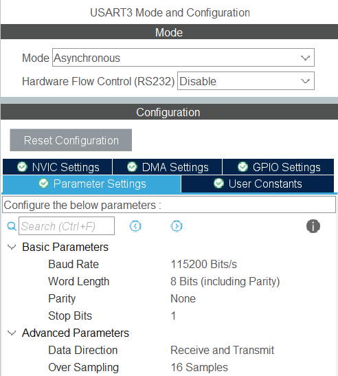

# Bare Metal Training 07: SPI Flash

Implemented reading and rewriting for 16 Mbit SPI Serial Flash memory. It is also possible to output the read information to the console through the UART interface. It is possible to enter commands through the console to clear, read, write, change registers. 2 LEDs are also used to inform the user: Red and Blue.

## CubeMX

CubeMx has default settings selected. The SPI1 module was used to implement the SPI interface. It has pin **PB5** as *SPI1_MOSI*, pin **PB4** as *SPI1_MISO* and pin **PA5** as *SPI1_SCK*. **PD7** is also used in *GPIO_Output* mode for Chip Select.


The USART3 module was used to implement the UART interface. It has pin **PD9** as *USART3_RX* and pin **PD8** as *USART3_TX*. Two pins were selected for LEDs: **PD14, PD15**. They have been switched to *GPIO_Output* mode.


SPI is configured according to interface with flash memory.


The following settings were set for UART:



## Code review

After generating the code based on CubeMX, changes were made to the `while(1){}` part where the main body of the program is executed.

```C
  while (1)
  {
		uint8_t rcvBuf[1];
		HAL_StatusTypeDef result;

		result = HAL_UART_Receive(&huart3, rcvBuf, 1, 10);

		if (result == HAL_OK)
		{
			if (rcvBuf[0] == 's') //show data
			{
				if (readData == YES)
				{
					HAL_GPIO_TogglePin(GPIOD, GPIO_PIN_15);
					HAL_UART_Transmit(&huart3, (uint8_t *)dataI, BUFFER_SIZE, HAL_MAX_DELAY);
				}
				else
				{
					char message[] = "First read data from flash\r\n";
					HAL_UART_Transmit(&huart3, (uint8_t *) message, sizeof(message), 100);
				}
				HAL_Delay(1000);
			}

			if (rcvBuf[0] == 'r') //read data from flash
			{
				  HAL_UART_Transmit(&huart3, (uint8_t *)"Reading...\r\n", 12, 100);
				  readDataFromFlash();
				  HAL_UART_Transmit(&huart3, (uint8_t *)"\r\ndata was read", 16, 100);
				  HAL_Delay(1000);
			}

			if (rcvBuf[0] == 'w') //write data in flash
			{
				  HAL_UART_Transmit(&huart3, (uint8_t *)"Writing...", 10, 100);
				  writeByteDataInFlash();
				  HAL_UART_Transmit(&huart3, (uint8_t *)"Data was write", 14, 100);
				  HAL_Delay(1000);
			}

			if (rcvBuf[0] == 'a') //auto address increment write data in flash
			{
				  HAL_UART_Transmit(&huart3, (uint8_t *)"Writing AAI...", 13, 100);
				  writeAAIDataInFlash(textForSend);
				  HAL_UART_Transmit(&huart3, (uint8_t *)"Data was write", 14, 100);
				  HAL_Delay(1000);
			}

			if (rcvBuf[0] == 'c') //auto address increment write data in flash
			{
				  TransmitArray[0] = 0x06; //WREN
				  HAL_GPIO_WritePin(GPIOD, GPIO_PIN_7, GPIO_PIN_RESET);
				  HAL_SPI_Transmit(&hspi1, TransmitArray, 1, 100);
				  HAL_GPIO_WritePin(GPIOD, GPIO_PIN_7, GPIO_PIN_SET);

				  TransmitArray[0] = 0x60;  //clear cheap

				  HAL_UART_Transmit(&huart3, (uint8_t *)"Clear chip...", 13, 100);

				  HAL_GPIO_WritePin(GPIOD, GPIO_PIN_7, GPIO_PIN_RESET);
				  HAL_SPI_Transmit(&hspi1, TransmitArray, 1, 1000);
				  HAL_GPIO_WritePin(GPIOD, GPIO_PIN_7, GPIO_PIN_SET);

				  HAL_UART_Transmit(&huart3, (uint8_t *)"Cleared chip...", 15, 100);
				  HAL_Delay(1000);
			}

			if (rcvBuf[0] == 'x') //read register data from flash
			{
				  TransmitArray[0] = 0x05;

				  HAL_UART_Transmit(&huart3, (uint8_t *)"Read register data...\r\n", 23, 100);

				  HAL_GPIO_WritePin(GPIOD, GPIO_PIN_7, GPIO_PIN_RESET);
				  HAL_SPI_Transmit(&hspi1, TransmitArray, 1, 100);
				  HAL_SPI_Receive(&hspi1, ReceiveArray, 1, 100);
				  HAL_GPIO_WritePin(GPIOD, GPIO_PIN_7, GPIO_PIN_SET);

				  char binString[8] = { '0' };
				  itoa(ReceiveArray[0], binString, 2);
				  HAL_UART_Transmit(&huart3, (uint8_t *)binString, strlen(binString), 100);
				  HAL_Delay(1000);
			}

			if (rcvBuf[0] == 'e') //WREN
			{
				TransmitArray[0] = 0x06;

				HAL_UART_Transmit(&huart3, (uint8_t *)"WREN...", 8, 100);

				HAL_GPIO_WritePin(GPIOD, GPIO_PIN_7, GPIO_PIN_RESET);
				HAL_SPI_Transmit(&hspi1, TransmitArray, 1, 100);
				HAL_GPIO_WritePin(GPIOD, GPIO_PIN_7, GPIO_PIN_SET);

				HAL_UART_Transmit(&huart3, (uint8_t *)"WREN.OK", 8, 100);
				HAL_Delay(1000);
			}

			if (rcvBuf[0] == 'o') //Open block write protection
			{
				HAL_UART_Transmit(&huart3, (uint8_t *)"Open BWP...\r\n", 13, 100);
				openBlockDataProtectionFlash();
				HAL_UART_Transmit(&huart3, (uint8_t *)"BWP is disable", 14, 100);
				HAL_Delay(1000);
			}
		}

	HAL_Delay(100);
  }
```

This code allows you to interact with the flash memory through the UART interface, through which the user can send the appropriate commands for execution.

### **Function**

These functions were created for the task, namely:
 * [`readDataFromFlash`](#readdatafromflash), 
 * [`writeByteDataInFlash`](#writebytedatainflash),
 * [`writeAAIDataInFlash`](#writeaaidatainflash), 
 * [`openBlockDataProtectionFlash`](#openblockdataprotectionflash).

#### ***readDataFromFlash***

Reads all information from the flash memory and transfers it to the buffer.

```C
void readDataFromFlash()
{
	uint8_t buffer[BUFFER_SIZE] = { 0 };
	uint32_t address;

	for (uint32_t j = 0; j < BUFFER_SIZE; ++j)
	{
		dataI[j] = 0;
	}

	HAL_GPIO_WritePin(GPIOD, GPIO_PIN_14, GPIO_PIN_SET); //red LED on
	address = 0;
	for (address = 0; address < MEMORY_SIZE+1; address += BUFFER_SIZE)
	{
		// Set the chip select signal low to select the SST25VF016B memory
		HAL_GPIO_WritePin(GPIOD, GPIO_PIN_7, GPIO_PIN_RESET);

		// Send the Read command (0x03) and address to the memory
		uint8_t address_bytes[20];
		address_bytes[0] = (address >> 16) & 0xFF;
		address_bytes[1] = (address >> 8) & 0xFF;
		address_bytes[2] = address & 0xFF;
		HAL_SPI_Transmit(&hspi1, (uint8_t[]) {0x03, address_bytes[0], address_bytes[1], address_bytes[2]}, 4, 100);

		// Receive data from the memory into the buffer
		HAL_SPI_Receive(&hspi1, buffer, BUFFER_SIZE, 1000);

		// Set the chip select signal high to deselect the SST25VF016B memory
		HAL_GPIO_WritePin(GPIOD, GPIO_PIN_7, GPIO_PIN_SET);

		for (uint16_t i = 0; i < BUFFER_SIZE; ++i)
		{
			if (buffer[i] != 255)
			{
				dataI[dataCounter++] = buffer[i];
			}
		}
  }
  HAL_GPIO_WritePin(GPIOD, GPIO_PIN_14, GPIO_PIN_RESET); //red LED off
  readData = YES;
  HAL_UART_Transmit(&huart3, (uint8_t *)dataI, BUFFER_SIZE, 1000);
}
```

#### ***writeByteDataInFlash***

Writes a byte of information to flash memory if it is open for writing.

```C
void writeByteDataInFlash()
{
	uint8_t TransmitArray[5] = { 0 };

	//Prepare WRITE-ENABLE (WREN) command
	TransmitArray[0] = 0x06;

	HAL_GPIO_WritePin(GPIOD, GPIO_PIN_7, GPIO_PIN_RESET); 	// CS = LOW
	HAL_SPI_Transmit(&hspi1, TransmitArray, 1, 100);
	HAL_GPIO_WritePin(GPIOD, GPIO_PIN_7, GPIO_PIN_SET); 	// CS = HIGH

	//Prepare BYTE-PROGRAM command with address and data
	TransmitArray[0] = 0x02;
	TransmitArray[1] = 0x00;
	TransmitArray[2] = 0x00;
	TransmitArray[3] = 0x02;
	//data
	TransmitArray[4] = 0x23;

	HAL_GPIO_WritePin(GPIOD, GPIO_PIN_7, GPIO_PIN_RESET);	// CS = LOW
	HAL_SPI_Transmit(&hspi1, TransmitArray, 5, 100);
	HAL_GPIO_WritePin(GPIOD, GPIO_PIN_7, GPIO_PIN_SET);		// CS = HIGH

	//Prepare WRITE-DISABLE (WRDI) command
	TransmitArray[0] = 0x04;
	HAL_GPIO_WritePin(GPIOD, GPIO_PIN_7, GPIO_PIN_RESET); 	// CS = LOW
	HAL_SPI_Transmit(&hspi1, TransmitArray, 1, 100);
	HAL_GPIO_WritePin(GPIOD, GPIO_PIN_7, GPIO_PIN_SET); 	// CS = HIGH
}
```

#### ***writeAAIDataInFlash***

Writes certain information to the flash memory, if it was previously cleared and opened for writing.

```C
void writeAAIDataInFlash(char* message)
{
	uint8_t TransmitArray[6] = { 0 };
	uint8_t counterAddr = 0;
	uint8_t address[3] = { 0 };

	address[0] = 0x00;
	address[1] = 0x00;
	address[2] = 0x00;

	uint16_t i = 0;

	while(i < strlen(message))
	{
		//Prepare WRITE-ENABLE (WREN) command
		TransmitArray[0] = 0x06;

		HAL_GPIO_WritePin(GPIOD, GPIO_PIN_7, GPIO_PIN_RESET); 	// CS = LOW
		HAL_SPI_Transmit(&hspi1, TransmitArray, 1, 100);
		HAL_GPIO_WritePin(GPIOD, GPIO_PIN_7, GPIO_PIN_SET); 	// CS = HIGH

		//AII command
		TransmitArray[0] = 0xAD;
		TransmitArray[1] = address[0];
		TransmitArray[2] = address[1];
		TransmitArray[3] = address[2];
		//data
		TransmitArray[4] = message[i++];
		TransmitArray[5] = message[i++];

		HAL_GPIO_WritePin(GPIOD, GPIO_PIN_7, GPIO_PIN_RESET);	// CS = LOW
		HAL_SPI_Transmit(&hspi1, TransmitArray, 6, 100);
		HAL_GPIO_WritePin(GPIOD, GPIO_PIN_7, GPIO_PIN_SET);		// CS = HIGH

		for ( ; i < strlen(message); i+=2)
		{
			//AAI command
			TransmitArray[0] = 0xAD;
			//data
			TransmitArray[1] = message[i];
			TransmitArray[2] = message[i+1];

			if (message[i] == '\n')
			{
				TransmitArray[2] = 0;
				i--;
			}

			HAL_GPIO_WritePin(GPIOD, GPIO_PIN_7, GPIO_PIN_RESET);	// CS = LOW
			HAL_SPI_Transmit(&hspi1, TransmitArray, 3, 100);
			HAL_GPIO_WritePin(GPIOD, GPIO_PIN_7, GPIO_PIN_SET);		// CS = HIGH

			if (message[i+1] == '\n' || message[i] == '\n')
			{
				counterAddr++;
				address[0] = (0x10 * counterAddr) / 100;
				address[1] = (0x10 * counterAddr) % 100;
				address[2] = 0x00;
				i+=2;
				break;
			}

		}
		//Prepare WRITE-DISABLE (WRDI) command
		TransmitArray[0] = 0x04;

		HAL_GPIO_WritePin(GPIOD, GPIO_PIN_7, GPIO_PIN_RESET); 	// CS = LOW
		HAL_SPI_Transmit(&hspi1, TransmitArray, 1, 100);
		HAL_GPIO_WritePin(GPIOD, GPIO_PIN_7, GPIO_PIN_SET); 	// CS = HIGH
	}
}
```

#### ***openBlockDataProtectionFlash***

Removes restrictions on writing from flash memory blocks.

```C
void openBlockDataProtectionFlash()
{
	uint8_t TransmitArray[2] = { 0 };

	//Write-Status-Register
	TransmitArray[0] = 0x50;

	HAL_GPIO_WritePin(GPIOD, GPIO_PIN_7, GPIO_PIN_RESET); 	// CS = LOW
	HAL_SPI_Transmit(&hspi1, TransmitArray, 1, 100);
	HAL_GPIO_WritePin(GPIOD, GPIO_PIN_7, GPIO_PIN_SET); 	// CS = HIGH

	//Enable-Write-Status-Registerb
	TransmitArray[0] = 0x01;
	TransmitArray[1] = 0x00; //all 0

	HAL_GPIO_WritePin(GPIOD, GPIO_PIN_7, GPIO_PIN_RESET); 	// CS = LOW
	HAL_SPI_Transmit(&hspi1, TransmitArray, 2, 100);
	HAL_GPIO_WritePin(GPIOD, GPIO_PIN_7, GPIO_PIN_SET); 	// CS = HIGH
}
```

## Result

The Logic program was used for data visualization. In it, you can see how the signals are sent through the RX and TX channels. Also, how SPI interacts with flash memory, how their commands are sent and received in return. A red LED is also used here, which signals the beginning and end of reading information from the flash memory.


This image is an overview, and to better understand the essence of the changes, you can use the file [.sal](../../photoForReadme/Bare_Metal_Training/task07/Session_task07.sal) file from which the screenshots were made.  In it, you can better understand how the commands were received and what was the reaction to them.

For the task, information was recorded in flash memory. Here's how it looked in the console:

