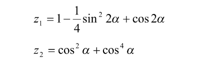

# Pure C Training 02: Basic calculations

Based on the task, the calculation of the formula was implemented.

Also, 5 program runs were conducted, as a result of which the corresponding values were obtained.

***

 alfa = 15.000000  
 z1 = 1.154251  
 z2 = 0.910200  

 alfa = 7.000000  
 z1 = 1.136737  
 z2 = 0.891411  

 alfa = 17.000000  
 z1 = 0.151430  
 z2 = 0.081448  

 alfa = 16.000000  
 z1 = 1.834223  
 z2 = 1.758206  

 alfa = 14.000000  
 z1 = 0.037394  
 z2 = 0.019047  
