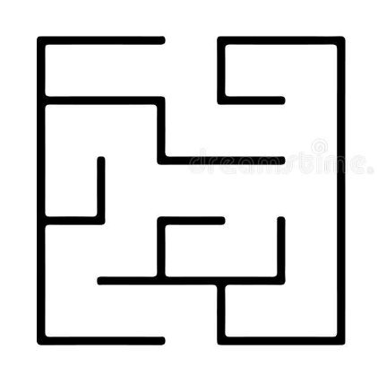
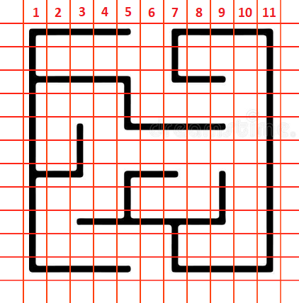
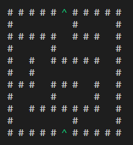
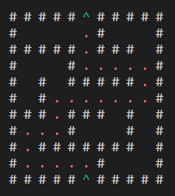
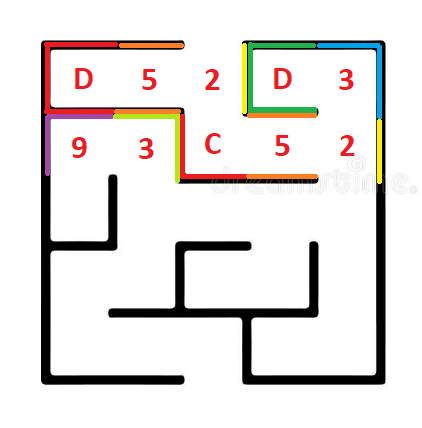
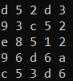
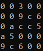
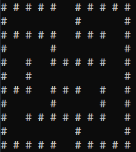
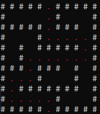

# Pure C Training 04:  Maze (Labyrinth)

The code for the implementation of the algorithm of passage through the maze was created. A visual version of the path leading out of the labyrinth is also presented.  
Two variants for implementing the logic of working with the maze are presented, named [mainWay](#mainway) and [secondWay](#secondway).

## Recursive algorithm

If given an omniscient view of the maze, a simple recursive algorithm can tell one how to get to the end. The algorithm will be given a starting X and Y value. If the X and Y values are not on a wall, the method will call itself with all adjacent X and Y values, making sure that it did not already use those X and Y values before. If the X and Y values are those of the end location, it will save all the previous instances of the method as the correct path.

This is in effect a depth-first search expressed in term of grid points. The omniscient view prevents entering loops by memorization.

## MainWay

In *mainWay* method, the maze is interpreted as an 11 by 11 array of data, which is convenient for programming, but not so obvious to the user, who needs to enter data about the entrance and exit of the maze and change its design if necessary.


&nbsp;


Without a grid, it is quite difficult to understand exactly which coordinates are the entrance and exit from the labyrinth.

And in the code, the maze will look like this:

```C
#define SIDE_SIZE 11

int myLabyrinth[SIDE_SIZE][SIDE_SIZE] = {
    {1, 1, 1, 1, 1, 2, 1, 1, 1, 1, 1}, 
    {1, 0, 0, 0, 0, 0, 1, 0, 0, 0, 1}, 
    {1, 1, 1, 1, 1, 0, 1, 1, 1, 0, 1},
    {1, 0, 0, 0, 1, 0, 0, 0, 0, 0, 1}, 
    {1, 0, 1, 0, 1, 1, 1, 1, 1, 0, 1}, 
    {1, 0, 1, 0, 0, 0, 0, 0, 0, 0, 1},
    {1, 1, 1, 0, 1, 1, 1, 0, 1, 0, 1}, 
    {1, 0, 0, 0, 1, 0, 0, 0, 1, 0, 1}, 
    {1, 0, 1, 1, 1, 1, 1, 1, 1, 0, 1},
    {1, 0, 0, 0, 0, 0, 1, 0, 0, 0, 1}, 
    {1, 1, 1, 1, 1, 2, 1, 1, 1, 1, 1}
};
```

## Code review

### **Struct**

To describe the labyrinth, a struct was created, which contains data about the labyrinth, and also, as a result of the operations, receives a path that leads to the solution.

```C
#define SIDE_SIZE 11

struct Labyrinth
{
    int labyrintShablon[SIDE_SIZE][SIDE_SIZE];
    int startX, startY;
    int endX, endY; 

    int wasHere[SIDE_SIZE][SIDE_SIZE];
    int correctPath[SIDE_SIZE][SIDE_SIZE];
};
```

### **Function**

Four functions were created for the task, namely `Labyrinth_Print`, `Labyrinth_Solve`, `recursiveSolve` and `Labyrint_CopyShablon`.

#### ***Labyrinth_Print***

Outputs the maze to the console. Shows walls, passage, start and end, and a path if one has already been found.

```C
void Labyrinth_Print(int labyrinth[SIDE_SIZE][SIDE_SIZE])
{
    printf("\n");
    for (int i = 0; i < SIDE_SIZE; i++)
    {
        for (int j = 0; j < SIDE_SIZE; j++)
        {
            if (labyrinth[i][j] == border)
            {
                printf("# ");
            }
            else if (labyrinth[i][j] == passage)
            {
                printf("  ");
            }
            else if (labyrinth[i][j] == start_end)
            {
                printf(ANSI_COLOR_GREEN);
                printf("^ ");
                printf(ANSI_COLOR_RESET);
            }
            else if (labyrinth[i][j] == path)
            {
                printf(ANSI_COLOR_RED);
                printf(". ");
                printf(ANSI_COLOR_RESET);
            }
        }
        printf("\n");
    }
}
```

#### ***Labyrint_CopyShablon***

Copies a maze map to another maze. The maze being copied usually already contains a map of the walls.

```C
void Labyrint_CopyShablon(struct Labyrinth *thisLabyrinth, int labyrintShablon[SIDE_SIZE][SIDE_SIZE])
{
    memcpy(thisLabyrinth->labyrintShablon, labyrintShablon, sizeof(thisLabyrinth->labyrintShablon));
}
```

#### ***Labyrinth_Solve***

A function in which the search for a path in a maze is performed, as well as the entrance and exit from it are marked.

```C
void Labyrinth_Solve(struct Labyrinth *thisLabyrinth)
{
    for (int row = 0; row < SIDE_SIZE; row++)
    {
        for (int col = 0; col < SIDE_SIZE; col++)
        {
            thisLabyrinth->wasHere[row][col] = 0;
        }
    }

    memcpy(thisLabyrinth->correctPath, thisLabyrinth->labyrintShablon, sizeof(thisLabyrinth->labyrintShablon));

    recursiveSolve(thisLabyrinth, thisLabyrinth->startX, thisLabyrinth->startY);

    thisLabyrinth->correctPath[thisLabyrinth->startY][thisLabyrinth->startX] = start_end;
    thisLabyrinth->correctPath[thisLabyrinth->endY][thisLabyrinth->endX] = start_end;
}
```

#### ***recursiveSolve***

The function starts its work at the entrance and checks all 4 directions (left, right, top and bottom) to see if it is a wall or a passage. If a passage is found, then it launches its copy, which will check its branch of the labyrinth to the end. If necessary, it will split again and check other turns of the labyrinth. These will all be performed by copies of the same function. If one of the functions finds an exit, the recursion will begin to collapse and recording the correct path starting from the exit and ending with the entrance. As a result, the correct path will be obtained.

```C
int recursiveSolve(struct Labyrinth *thisLabyrinth, int x, int y)
{
    if (x == thisLabyrinth->endX && y == thisLabyrinth->endY)
        return 1;
    if (myLabyrinth[y][x] == border || thisLabyrinth->wasHere[y][x])
        return 0;
    
    thisLabyrinth->wasHere[y][x] = 1;
    if (x != 0) // left
        if (recursiveSolve(thisLabyrinth, x - 1, y))
        {
            thisLabyrinth->correctPath[y][x] = path;
            return 1;
        }
    if (x != SIDE_SIZE - 1) //right
        if (recursiveSolve(thisLabyrinth, x + 1, y))
        {
            thisLabyrinth->correctPath[y][x] = path;
            return 1;
        }
    if (y != 0) // top
        if (recursiveSolve(thisLabyrinth, x, y - 1))
        {
            thisLabyrinth->correctPath[y][x] = path;
            return 1;
        }
    if (y != SIDE_SIZE - 1) // bottom
        if (recursiveSolve(thisLabyrinth, x, y + 1))
        {
            thisLabyrinth->correctPath[y][x] = path;
            return 1;
        }
    return 0;
}
```

### **Result**

After printing the result, we will get the following solution to this maze.





***

## SecondWay

In the *secondWay* method, the maze is interpreted as a 5 by 5 data array, which is more visual for the user, but much more difficult in software implementation. You just need to choose which of the 16 options the cell belongs to, or if it's easier, on which sides the cell have barriers.

In order to set these options, you can use the binary notation of the number. Only 4 bits are needed, the logic of writing into which will be as follows:

```
0000 - 0 - no border
0001 - 1 - top border 
0010 - 2 - right border
0011 - 3
0100 - 4 - bottom border
0101 - 5
0110 - 6
0111 - 7
1000 - 8 - left border
1001 - 9
1010 - A
1011 - B
1100 - C
1101 - D
1110 - E
1111 - F
```

If you read the number from left to right, it turns out that the wall is marked:
 * 1 bit - left
 * 2 bit - bottom
 * 3 bit - right
 * 4 bit - top

As an example:

```
0b:
1 - left	|
1 - bottom	|---> E
1 - right	|
0 - top		|
```

Having this way of presentation, the labyrinth can be divided in the following way:


&nbsp;


In this way, it is much easier for the user to fill in the information about the labyrinth, the main thing is to check with the table where which wall is located.

And in the code, the maze will look like this:

```C
#define SIDE_SIZE 5

int myLabyrinth[SIDE_SIZE][SIDE_SIZE] = {{0xD, 0x5, 0x2, 0xD, 0x3},
                                         {0x9, 0x3, 0xC, 0x5, 0x2},
                                         {0xE, 0x8, 0x5, 0x1, 0x2},
                                         {0x9, 0x6, 0xD, 0x6, 0xA},
                                         {0xC, 0x5, 0x3, 0xD, 0x6}};
```

## Code review

### **Struct**

To describe the maze, a struct was created, which contains data about the maze, and also, as a result of operations, receives a path leading to a solution. Also, compared to the previous version, an array was added, thanks to which the maze is displayed on the console.

```C

#define SIDE_SIZE 5
#define SIDE_FOR_PRINT_SIZE (2 * SIDE_SIZE + 1)

struct Labyrinth
{
    int labyrintShablon[SIDE_SIZE][SIDE_SIZE];
    int startX, startY;
    int endX, endY;

    int wasHere[SIDE_SIZE][SIDE_SIZE];
    int correctPath[SIDE_SIZE][SIDE_SIZE];
    int labyrinthForPrint[SIDE_FOR_PRINT_SIZE][SIDE_FOR_PRINT_SIZE];
};
```

### **Function**

Seven functions were created for the task, namely
 * `Labyrinth_Print`,
 * `Labyrinth_PrintDeployed`,
 * `prepareLabyrinthForPrintArrArr`,
 * `Labyrinth_Solve`,
 * `recursiveSolve`,
 * `addCorrectPathToLabyrinth`,
 * `Labyrint_CopyShablon`.

#### ***Labyrinth_Print***

Outputs the maze to the console. Shows it in the form of 5 by 5. In this form, it may not be completely clear to the user, since the console does not have the ability to display its appearance correctly. Therefore, it is necessary to output data in the form of hexadecimal characters.

```C
void Labyrinth_Print(int labyrinth[SIDE_SIZE][SIDE_SIZE])
{
    printf("\n");
    for (int i = 0; i < SIDE_SIZE; i++)
    {
        for (int j = 0; j < SIDE_SIZE; j++)
        {
            printf("%x ", labyrinth[i][j]);
        }
        printf("\n");
    }
}
```

#### ***Labyrinth_PrintDeployed***

Outputs the maze to the console. Shows it in the form of 11 by 11. In this form, it is convenient for implementation on the console and is more visual for the user. But its derivation requires preliminary transformations of the basic 5 by 5 maze.

```C
void Labyrinth_PrintDeployed(int labyrinth[SIDE_FOR_PRINT_SIZE][SIDE_FOR_PRINT_SIZE])
{
    printf("\n");
    for (int i = 0; i < SIDE_FOR_PRINT_SIZE; i++)
    {
        for (int j = 0; j < SIDE_FOR_PRINT_SIZE; j++)
        {
            if (labyrinth[i][j] == border)
            {
                printf("# ");
            }
            else if (labyrinth[i][j] == passage)
            {
                printf("  ");
            }
            else if (labyrinth[i][j] == start_end)
            {
                printf(ANSI_COLOR_GREEN);
                printf("^ ");
                printf(ANSI_COLOR_RESET);
            }
            if (labyrinth[i][j] == path)
            {
                printf(ANSI_COLOR_RED);
                printf(". ");
                printf(ANSI_COLOR_RESET);
            }
        }
        printf("\n");
    }
}
```

#### ***prepareLabyrinthForPrintArrArr***

Converts a 5x5 maze into an 11x11 maze suitable for console output. Analyzing the cell for where the walls are located in it, it enters information about the walls into the larger array.

```C
void prepareLabyrinthForPrintArrArr(int MazeShab[SIDE_SIZE][SIDE_SIZE], int MazeForPrint[SIDE_FOR_PRINT_SIZE][SIDE_FOR_PRINT_SIZE])
{
    for (int i = 0; i < SIDE_FOR_PRINT_SIZE; i++)
    {
        for (int j = 0; j < SIDE_FOR_PRINT_SIZE; j++)
        {
            MazeForPrint[i][j] = 0;
        }
    }

    for (int i = 0; i < SIDE_SIZE; i++)
    {
        for (int j = 0; j < SIDE_SIZE; j++)
        {
            if (((MazeShab[i][j] >> 3) & 1) == 1) // left - 8 - 1000
            {
                MazeForPrint[2 * i][2 * j] = 1;
                MazeForPrint[2 * i + 1][2 * j] = 1;
                MazeForPrint[2 * i + 2][2 * j] = 1;
            }
            if (((MazeShab[i][j] >> 1) & 1) == 1) // right - 2 - 0010
            {
                MazeForPrint[2 * i][2 * j + 2] = 1;
                MazeForPrint[2 * i + 1][2 * j + 2] = 1;
                MazeForPrint[2 * i + 2][2 * j + 2] = 1;
            }
            if (((MazeShab[i][j]) & 1) == 1) // top - 1 - 0001
            {
                MazeForPrint[2 * i][2 * j] = 1;
                MazeForPrint[2 * i][2 * j + 1] = 1;
                MazeForPrint[2 * i][2 * j + 2] = 1;
            }
            if (((MazeShab[i][j] >> 2) & 1) == 1) // bottom - 4 - 0100
            {
                MazeForPrint[2 * i + 2][2 * j] = 1;
                MazeForPrint[2 * i + 2][2 * j + 1] = 1;
                MazeForPrint[2 * i + 2][2 * j + 2] = 1;
            }
        }
    }
}
```

#### ***Labyrinth_Solve***

A function in which a search for a path in a maze is performed. It calls a recursive function that implements the further path search.

```C
void Labyrinth_Solve(struct Labyrinth *thisLabyrinth)
{
    for (int row = 0; row < SIDE_SIZE; row++)
    {
        for (int col = 0; col < SIDE_SIZE; col++)
        {
            thisLabyrinth->wasHere[row][col] = 0;
            thisLabyrinth->correctPath[row][col] = 0;
        }
    }

    recursiveSolve(thisLabyrinth, thisLabyrinth->labyrintShablon, thisLabyrinth->startX, thisLabyrinth->startY, top);
}
```

#### ***recursiveSolve***

The function works similarly to the previous method. The difference is that it is not the neighboring cells that are checked for the possibility of a passage, but this cell itself, whether it has passages (there are no walls). If a passage is found, a copy of the same function is launched in the cell in which it is necessary to pass. Information is also transmitted from which cell the pass was made. This is needed to blow the passage through the maze later, when the exit is found. When the exit is found, the recursion will begin to collapse and record the correct path, starting from the exit and ending with the entrance.

```C
int recursiveSolve(struct Labyrinth *thisLabyrinth, int MazeShab[SIDE_SIZE][SIDE_SIZE], int x, int y, int comeFrom)
{
    if (x == thisLabyrinth->endX && y == thisLabyrinth->endY)
    {
        thisLabyrinth->correctPath[y][x] = placementCorrectPathElement(comeFrom, bottom);
        return 1;
    }

    if (thisLabyrinth->wasHere[y][x])
    {
        return 0;
    }

    thisLabyrinth->wasHere[y][x] = 1;
    if (((MazeShab[y][x] >> 3) & 1) == 0)                             // left - 8 - 1000
        if (recursiveSolve(thisLabyrinth, MazeShab, x - 1, y, right)) // move left --> came from right
        {
            thisLabyrinth->correctPath[y][x] = placementCorrectPathElement(comeFrom, left);
            return 1;
        }
    if (((MazeShab[y][x] >> 1) & 1) == 0) // right - 2 - 0010
        if (recursiveSolve(thisLabyrinth, MazeShab, x + 1, y, left))
        {
            thisLabyrinth->correctPath[y][x] = placementCorrectPathElement(comeFrom, right);
            return 1;
        }
    if (((MazeShab[y][x]) & 1) == 0)                                   // top - 1 - 0001
        if (recursiveSolve(thisLabyrinth, MazeShab, x, y - 1, bottom)) // move top --> came from bottom
        {
            thisLabyrinth->correctPath[y][x] = placementCorrectPathElement(comeFrom, top);
            return 1;
        }
    if (((MazeShab[y][x] >> 2) & 1) == 0) // bottom - 4 - 0100
        if (recursiveSolve(thisLabyrinth, MazeShab, x, y + 1, top))
        {
            thisLabyrinth->correctPath[y][x] = placementCorrectPathElement(comeFrom, bottom);
            return 1;
        }
    return 0;
}
```

placementCorrectPathElement

#### ***addCorrectPathToLabyrinth***

This function works similarly to `prepareLabyrinthForPrintArrArr`, but it will not be walls, but the correct path through the maze. It transfers information about the path from array 5 by 5, to array 11 by 11. That allows you to display data about the path in a more convenient form for the user.

```C
void addCorrectPathToLabyrinth(int MazeCorrectPath[SIDE_SIZE][SIDE_SIZE], int MazeForPrint[SIDE_FOR_PRINT_SIZE][SIDE_FOR_PRINT_SIZE])
{
    for (int i = 0; i < SIDE_SIZE; i++)
    {
        for (int j = 0; j < SIDE_SIZE; j++)
        {
            if (MazeCorrectPath[i][j] == top_bottom)
            {
                MazeForPrint[2 * i][2 * j + 1] = path;
                MazeForPrint[2 * i + 1][2 * j + 1] = path;
                MazeForPrint[2 * i + 2][2 * j + 1] = path;
            }
            if (MazeCorrectPath[i][j] == left_right)
            {
                MazeForPrint[2 * i + 1][2 * j] = path;
                MazeForPrint[2 * i + 1][2 * j + 1] = path;
                MazeForPrint[2 * i + 1][2 * j + 2] = path;
            }
            if (MazeCorrectPath[i][j] == bottom_right)
            {
                MazeForPrint[2 * i + 1][2 * j + 1] = path;
                MazeForPrint[2 * i + 1][2 * j + 2] = path;
                MazeForPrint[2 * i + 2][2 * j + 1] = path;
            }
            if (MazeCorrectPath[i][j] == left_bottom)
            {
                MazeForPrint[2 * i + 1][2 * j] = path;
                MazeForPrint[2 * i + 1][2 * j + 1] = path;
                MazeForPrint[2 * i + 2][2 * j + 1] = path;
            }
            if (MazeCorrectPath[i][j] == top_left)
            {
                MazeForPrint[2 * i][2 * j + 1] = path;
                MazeForPrint[2 * i + 1][2 * j] = path;
                MazeForPrint[2 * i + 1][2 * j + 1] = path;
            }
            if (MazeCorrectPath[i][j] == right_top)
            {
                MazeForPrint[2 * i][2 * j + 1] = path;
                MazeForPrint[2 * i + 1][2 * j + 1] = path;
                MazeForPrint[2 * i + 1][2 * j + 2] = path;
            }
        }
    }
}
```

A 5 by 5 array is used to transmit information about the path. It records where the path came from and where it leads. For better understanding, the corresponding `enum` is used.

```C
enum WayDirection
{
    top_bottom = 0b0011,
    left_right = 0b1100, 
    bottom_right = 0b1010,
    left_bottom = 0b0110,
    top_left = 0b0101,
    right_top = 0b1001
};
```

#### ***Labyrint_CopyShablon***

Copies a maze map to another maze. The maze being copied usually already contains a map of the walls.

```C
void Labyrint_CopyShablon(struct Labyrinth *thisLabyrinth, int labyrintShablon[SIDE_SIZE][SIDE_SIZE])
{
    memcpy(thisLabyrinth->labyrintShablon, labyrintShablon, sizeof(thisLabyrinth->labyrintShablon));
}
```

### **Result**

After printing the result, we will get the solution of this maze, as can be deduced in 2 forms. The first is in hex numbers, the second is more standard semigraphics. 


&nbsp;



&nbsp;

